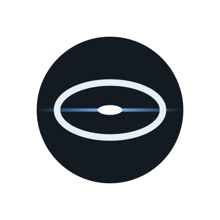
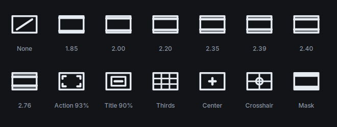
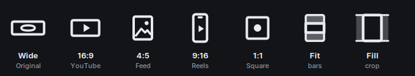

  

<h1 align="center">Anamorphic De-Squeeze</h1>

  A small, offline Android app that de-squeezes anamorphic video from <b>any camera</b>:
  phones, action cams, gimbals, mirrorless and cinema cameras shooting through an anamorphic lens or adapter.

  
  
  
  
  

  <a href="https://github.com/jemishmayani/Anamorphic-Desqueeze/releases/latest"><b>⬇ Download the latest APK</b></a> ·
  <a href="CHANGELOG.md">Changelog</a> ·
  <a href="https://github.com/jemishmayani/Anamorphic-Desqueeze/issues/new/choose">Report a bug</a> ·
  <a href="https://buymeacoffee.com/jemishmayani">Support the development</a>

---

**Contents:** [What it does](#what-it-does) · [Quick start](#quick-start) · [Works with your camera](#works-with-your-camera) ·
[Vertical anamorphic](#vertical-anamorphic) · [Export methods](#two-export-methods) · [Features](#features) ·
[Install & update](#install--update) · [FAQ](#faq) · [Known limitations](#known-limitations) · [Privacy](#privacy) ·
[Google Play](#google-play) · [How it works](#how-it-works-technical) · [Building](#building-it-yourself) ·
[Contributing & support](#contributing--support) · [License](#license)

## What it does

An anamorphic lens squeezes a wide scene horizontally onto the sensor, so the raw clip looks
thin and stretched. This app restores the correct shape by widening the image by the lens's
**squeeze factor**:

> 1920 × 1080 at **1.33×** → displays as **2554 × 1080**
> 3840 × 2160 at **1.33×** → displays as **5107 × 2160**

"Squeeze factor" here always means the lens squeeze, never a target aspect ratio. The app
**never crops** to 16:9, 2.39:1 or anything else; the whole frame is kept. The original file is
never modified.

## Quick start

| Step | What you do |
|---|---|
| **1. Clips** | Pick videos, or **share** them to De-Squeeze from your gallery. Each shows a thumbnail, duration, resolution, bit depth and detected log/HDR |
| **2. Frame** | Choose each clip's squeeze factor, orientation and desqueeze direction; trim; check exposure; frame with guides in the live preview |
| **3. Look** | Optional: pick a LUT from thumbnails of your clip, preview it live, set its strength, compare before/after, check exposure of the graded image |
| **4. Export** | Follow the recommendation (or pick the alternative), choose a social format if you like, check compatibility, size and time, then export, even in the background |

Exports are saved to `Movies/AnamorphicDesqueeze/` as `ORIGINALNAME_DESQUEEZED_1.33X.mp4`
(or `.mov` for MOV sources in Lossless mode). The folder can be changed in Settings.

## Works with your camera

The app isn't tied to one device. It reads each clip's header and shows what it finds as
badges, with full details one tap away:

| Detected | How |
|---|---|
| **Log profile:** D-Log / D-Log M, S-Log2/3, V-Log, Canon Log 2/3, F-Log/F-Log2, N-Log, Apple Log, L-Log, I-Log, Samsung Log, GoPro Log, Z-Log2, Blackmagic Film, ARRI LogC, RED Log3G10 | **Confirmed** only when the camera names it in a structured metadata field. Otherwise, five frames spread through the clip (skipping intros, endings, black/grey cards, title cards and graphics) are checked for the flat log look, giving at most **Possible** or **Likely** log (dashed badge), never Confirmed. See [How log is detected](#how-log-is-detected) |
| **HDR:** HLG, HDR10 (PQ), Dolby Vision; mastering metadata | Color tags and Dolby Vision boxes in the video track |
| **SDR** | Standard transfer tags and no log detected |
| **Bit depth & chroma:** 8/10/12-bit, 4:2:0, 4:2:2, 4:4:4 | Read from the codec configuration (`hvcC`, `avcC`, `av1C`, `vpcC`, ProRes type) |
| **Codec & profile:** HEVC, H.264, AV1, VP9, ProRes (Proxy to 4444 XQ), MPEG-4 | Sample entry type |
| **Color:** primaries (BT.709, BT.2020, P3), transfer, matrix, full/limited range | `colr` box, falling back to Android's track info |
| **Camera make & model** | QuickTime/iTunes metadata, Sony XML, or brand names in the header |
| **Existing pixel-aspect tag** | `pasp` box (shown as "Tagged 1.33×") |
| **Frame rate, audio format, duration, size, average bitrate** | Android's media extractor |

Only the header is read for metadata, so analysis is fast even for multi-GB files.

### How log is detected

Every clip gets a **gamma** (Log, SDR / Rec.709, HLG, PQ / HDR10 or Unknown) and a **confidence**
(Confirmed, Likely, Possible or Unknown), decided in this order. The clip's **All details** shows *why*.

| Order | Evidence | Result |
|---|---|---|
| 1 | Dolby Vision box, or transfer metadata PQ (SMPTE ST 2084) / HLG (ARIB STD-B67) | HDR10 / Dolby Vision / HLG, **Confirmed** |
| 2 | The camera names a log profile in a structured field (a gamma metadata key, camera XML) | That profile (e.g. D-Log M), **Confirmed** |
| 3 | Picture analysis of 5 frames through the clip, intro/ending/black/grey/title/graphic frames excluded; ≥ 3 usable frames, ≥ 70% flat | Log, **Possible**; **Likely** with a supporting hint (10-bit from a log-capable brand, or log mentioned in the title/comment) |
| 4 | Tagged BT.709 / sRGB and no log evidence | SDR, **Likely** (some log cameras use this tag too) |
| 5 | Nothing to go on | **Unknown** |

Text in titles and comments is never treated as camera data, so a YouTube video called "my vlog" isn't
mistaken for V-Log. The suggestion to use a log-to-Rec.709 LUT appears only for **confirmed** log, and
LUTs are never applied automatically.

## Vertical anamorphic

When a phone or camera is turned 90° with the anamorphic lens attached, the squeeze ends up
on the picture's vertical axis. The **Frame** step has two controls for this:

| Control | Options |
|---|---|
| **Orientation** | **Auto** uses the file's rotation metadata; **Landscape** / **Portrait** turn the picture to force that display, only for files whose rotation is missing or wrong (on a correctly recorded clip they lay the picture on its side) |
| **Desqueeze direction** | **Auto** stretches along the lens's squeeze axis (the sensor's horizontal axis, so vertically on screen when the clip is rotated 90°); **Horizontal** / **Vertical** choose the on-screen axis yourself |

Lossless writes a vertical pixel aspect (for example `100:133`) and, if you override orientation,
a corrected rotation matrix, still without touching the video data. Re-encode rotates and
stretches on the GPU.

## Two export methods

| | **Lossless** (default) | **Re-encode** |
|---|---|---|
| How it works | Copies the file byte-for-byte and adds a pixel-aspect-ratio tag (`pasp`), like setting pixel aspect in DaVinci Resolve | Decodes, stretches the pixels on the GPU, and encodes a new video |
| Quality | Bit-identical to the original: bit depth, log/HDR, bitrate, frame rate, audio and metadata untouched | Re-compressed; quality depends on the chosen preset |
| Speed | About as fast as copying the file | Real-time-ish; depends on the phone |
| Resolution | Always full original resolution, any squeeze | Limited by the phone's video encoder (often 4096 px wide), so large squeezes on 4K are scaled down evenly |
| LUTs | Not applied | Can apply a `.cube` LUT |
| Compatibility | Shown de-squeezed by apps that respect pixel aspect (VLC, DaVinci Resolve, Premiere Pro, Final Cut Pro, most desktop players). Some phone galleries, social apps and web players ignore the tag and show it squeezed | Shown de-squeezed everywhere, because the pixels themselves are wider |

**Tip:** use **Lossless** when the clip is going into an editor; use **Re-encode** when you
want a finished file to share directly or to burn in a LUT. In DaVinci Resolve, if a
Lossless clip still looks squeezed, check *Clip Attributes → Pixel Aspect Ratio*.

### Why Re-encode output can be smaller than "4K"

Phone hardware encoders have a maximum frame width; see **Settings → Device diagnostics** for
yours (for example, 4096 px). De-squeezing 4K footage at 1.33× needs a 5107 px wide frame,
so Re-encode shrinks the whole frame evenly to fit (about 4096 × 1732), keeping the shape
correct and never cropping. Editors such as LumaFusion instead letterbox or crop into a
3840 × 2160 frame; at 1.33× the picture inside that frame is about 3840 × 1624, so the
actual image detail is similar or lower.

## Features

**Framing**
- **Squeeze presets** 1.2×, 1.33×, 1.5×, 1.55×, 1.6×, 1.8×, 2.0×, plus any custom factor (1.00–3.00×, slider or typed). A **default squeeze** (preset or custom) is set in Settings
- **Per-clip squeeze:** every clip keeps its own factor, so one batch can mix adapters; **Apply to all** copies one factor to every clip
- **Double Desqueeze Protection:** a clip that's already tagged (e.g. 1.33×) triggers a warning with **Keep existing**, **Replace tag** or **Force anyway** (multiplies the factors)
- **Pinned preview with an icon tool bar** (Frame and Look steps): the preview stays put while you switch between Squeeze, Trim, Guides, Orientation, Exposure and LUT. On phones, **drag the handle** between the preview and the tools to resize them (double-tap to reset); the preview scales to fit. A dot marks tools you've changed; long-press an icon for its name. No scrolling back and forth
- **Framing guides**, each an icon tile you tap on or off: **frame lines** at 1.85, 2.00, 2.20, 2.35, 2.39, 2.40 and 2.76 : 1 (each icon shows that ratio's bars to scale) with an optional **mask**; **overlays** for action safe (93%) and title safe (90%) per SMPTE ST 2046-1, rule of thirds, center marker and crosshair, which combine freely. A dot on the Guides tool shows when any guide is on. Guides never crop the export

  
- **Cinema-style preview:** the frame springs between squeezed and de-squeezed shapes, with a dashed outline of the original frame and arrows showing the stretch; press and hold to see the original; play/pause, mute, live aspect-ratio readout; a **filmstrip timeline** to tap or drag
- **Trim:** a range slider plus **Start here / End here** at the playhead. Re-encode cuts exactly; Lossless starts on the nearest keyframe (usually under a second earlier) and still never re-encodes
- **Exposure scopes** that float over the video like on a camera monitor (**drag to move it anywhere**, tap to enlarge, × to close): **RGB histogram**, **waveform** in IRE, **RGB parade**, **vectorscope** with colour-bar targets and a skin-tone line, and **false color** with a legend, plus live readings (shadows, median, highlights, % clipped and crushed). With a LUT on, they show the graded picture
  Scopes are sampled at 384 px and drawn like a monitor scope: a phosphor-style brightness curve keeps both busy and faint areas readable, with a labelled IRE graticule; the histogram has 256 levels per channel.

**Look**
- **LUT picker with previews:** every LUT is a small tile showing your current clip through it, so you can compare looks at a glance
- **LUT library:** import (several files at once, with duplicates skipped), rename and delete your own 3D `.cube` LUTs. None are bundled; import your camera maker's official log-to-Rec.709 LUT
- **LUT preview:** off / on while the video plays (a lighter ~720p proxy keeps 4K 10-bit smooth), strength with 0% / 50% / 100% marks, and a full-quality **before / after** still with a draggable divider

**Export**
- **Output formats** (Re-encode), chosen per clip: **Cinema:** original wide, **2.39 : 1 Scope**, **2.00 : 1**, **1.85 : 1 Flat**; **Social:** **16:9** (YouTube), **4:5** feed, **9:16** Reels/Shorts/TikTok, **1:1**. **Fit** with black bars or **Fill** by cropping, with a live preview. **Resolution** per clip: Auto, 1080p, 1440p or **4K** (e.g. UHD scope 3840 × 1606, 9:16 at 2160 × 3840), never upscaled past the source

  

- **Background export:** keeps running when you switch apps or lock the phone, with a progress notification and Cancel. The panel shows overall and per-clip progress, then an **Exported** summary (with **Play**) that stays until you tap Done
- **Progress everywhere you wait:** reading clips ("clip 2 of 5"), the preview starting, filmstrip thumbnails, LUTs being read, scopes warming up and size/time estimates
- **Smart recommendations** in plain language for each clip (e.g. "Lossless Desqueeze: preserves your original 10-bit D-Log footage"), with the alternative and why
- **Per-clip settings:** squeeze, orientation, desqueeze direction, trim, LUT and its strength, export method, format and resolution are all per clip, each with an **Apply to all** option.
- **Per-clip export method and format:** a batch can mix Lossless and Re-encode, and each clip has its own format; **Apply to all** or **Reset to recommended**. Picking a format on a Lossless clip switches it to Re-encode (amber notice with Undo); Lossless with a format set is flagged as a conflict in red
- **Compatibility check** for each clip (input, desqueeze, output, your phone's encoder limit, ✓ / ⚠ / ✗ result) and a **pre-export warning** that lists anything worth knowing before starting
- **Estimates** of output size and processing time, which learn your phone's real speed
- **Re-encode options:** HEVC (preferred) or H.264; Maximum / High / Balanced / Smaller File; frame rate and audio kept; automatic retries with safer settings if the encoder refuses
- **Batch export** with progress and a per-clip result list

**This phone**
- **Device diagnostics:** a plain-language summary; chipset, memory, storage, display HDR and graphics; measured and manufacturer speeds; a ✓ / ⚠ / ✗ checklist of decode/encode support (HEVC, 10-bit, H.264, AV1), maximum frame width, 4K frame rate and bitrate; and a squeeze check for 4K and 1080p. **Copy report** for bug reports
- **Crash reports** you can copy after an unexpected close

**App**
- Organized settings with **About & support**: check for updates (GitHub version), what's new, source code, privacy, licenses and [support the development](https://buymeacoffee.com/jemishmayani)
- **Share to De-Squeeze** from Google Photos, your gallery or a file manager (one or many videos)
- **Tablet & landscape layout:** the preview sits beside the controls on wide screens
- Light, dark or system theme with an **accent colour** of your choice (or your wallpaper's Material You colours); about 4 MB; no ads, accounts or tracking

## Install & update

1. Open the [latest release](https://github.com/jemishmayani/Anamorphic-Desqueeze/releases/latest) on your phone.
2. Download **`AnamorphicDesqueeze-vX.Y.apk`** under **Assets** and open it. (The `-play.aab` file is for Google Play and can't be installed directly.)
3. Allow **Install unknown apps** when Android asks. If Google Play Protect warns about an unknown developer, tap **Install anyway**.

**Requirements:** Android 10 or newer. Preview and Re-encode of 10-bit HEVC need hardware support,
which most phones from 2019 onwards have; **Settings → Device diagnostics** shows what yours can do.

**Updating:** from v1.7, every release is signed with the same permanent key, so new versions install
straight over the old one. **Settings → About → Check for updates** tells you when one is out.
If you have v1.6 or older, uninstall it once first; those builds used temporary keys.

**Is this download genuine?** Releases are signed with a certificate whose SHA-256 fingerprint is
`38:C0:B0:B2:C3:60:04:A3:90:49:A1:BD:11:7B:B0:04:2F:8C:04:54:1D:5B:F1:6A:DE:0F:59:B4:0E:1D:A4:5E`. [SECURITY.md](SECURITY.md#verifying-a-download) shows how to check it.

## FAQ

**My exported clip still looks squeezed.**
You probably used **Lossless** and opened it in an app that ignores the pixel-aspect tag (many phone
galleries, Instagram, WhatsApp, some web players). Editors such as DaVinci Resolve, Premiere Pro and
Final Cut, and players such as VLC, show it wide. To share directly, export with **Re-encode**, which
makes genuinely wider pixels, ideally with a **social format** (16:9, 4:5, 9:16 or 1:1). In Resolve,
check *Clip Attributes → Pixel Aspect Ratio* if needed.

**Which format should I use for Instagram?**
**4:5** for feed posts, **9:16** for Reels and Stories. **Fit** keeps the whole cinematic frame with
black bars (the classic anamorphic look); **Fill** crops the sides so the frame is filled.

**Can I lock my phone while exporting?**
Yes. Exports continue in the background with a progress notification.

**Why is my Re-encode smaller than 4K?**
Your phone's video encoder has a maximum width, often 4096 px. 4K at 1.33× needs 5107 px, so the whole
frame is scaled down evenly (about 4096 × 1732) instead of being cropped. The Export step warns you
before this happens. **Lossless** keeps full resolution at any squeeze.

**Does Re-encode keep my 10-bit log footage?**
No. Android re-encodes log/standard video in 8-bit (see [Known limitations](#known-limitations)).
Use **Lossless** to keep 10-bit; the app recommends it automatically for 10-bit, log and HDR clips.

**My camera's log profile isn't detected.**
Some cameras (many phones and action cams, including the DJI files checked so far) don't record the
profile name, and files re-saved by companion apps (such as DJI Mimo) may lose it. The app then judges
from the picture and shows a dashed **"Likely log"** or **"Possible log"** badge. Open **All details** to
see why. Without the profile name it can't tell D-Log from D-Log M, so pick your camera's LUT yourself. A short
sample clip in an [issue](https://github.com/jemishmayani/Anamorphic-Desqueeze/issues/new/choose) helps add detection.

**My vertical clip is stretched the wrong way.**
In the **Frame** step, set **Desqueeze direction** to **Vertical** (or Horizontal). If the clip itself
shows sideways, set **Orientation**.

**Can I install the GitHub APK over the Play Store version?**
No. Google re-signs Play installs, so the two can't update each other. Pick one source.

## Known limitations

- **Re-encode is 8-bit for log footage.** Log clips are almost always tagged as standard (SDR) video, and
  Android's GPU video pipeline processes SDR at 8-bit. Use Lossless to keep true 10-bit. Clips tagged
  HLG/PQ HDR stay 10-bit in Re-encode when *Keep HDR* is on.
- **Log detection depends on the camera** (see the FAQ).
- **Previews share the phone's video decoders.** Phones have only a few that handle 4K 10-bit, so the
  preview briefly waits for a free one when you change steps, clips or effects, and retries automatically
  if another app (or a running export) is using them. If it still can't start, tap **Retry**.
- **Preview and Re-encode need the phone to decode the codec.** ProRes, for example, usually can't be
  played on Android; Lossless tagging still works for it.
- **LUTs are applied at 8-bit precision, and only in Re-encode.** On some phones live LUT preview isn't
  supported; the app says so, and the before/after still still works.
- **Some camera-specific metadata** may not carry over in Re-encode (Lossless keeps everything).
- **Rotated + stretched clips in Lossless:** Lossless tags rotation and stretch separately, and some phone galleries apply them in the wrong order (showing e.g. 1 : 1.48 instead of 1 : 2.13). The app recommends Re-encode for these clips and warns before export.
- **Lossless trims start on a keyframe,** usually under a second before your in-point (re-encoding is the
  only way to cut on an exact frame). A trimmed Lossless file is rewritten as MP4, so camera-specific
  metadata may not carry over; the video and audio data stay untouched.
- **Background exports** rely on a notification. Some phones' battery savers can still stop them; if that
  happens, allow De-Squeeze to run in the background in Android's battery settings.

## Privacy

The app processes everything on your phone and collects no data: no accounts, ads, analytics or tracking.
The GitHub version goes online only when you tap *Check for updates*; the Play version never does.
Full details: [PRIVACY.md](PRIVACY.md).

## Google Play

The app meets Google Play's current requirements: it targets Android 16 (API 36), its native library
supports 16 KB memory pages, it requests no unnecessary permissions, and it ships as an Android App Bundle.
It's built in two versions:

| Version | File | Differences |
|---|---|---|
| **GitHub** | `.apk` | Can *Check for updates* against GitHub releases (the only time it uses the internet) |
| **Play** | `-play.aab` | No update checker (Play delivers updates) and no internet use |

Listing text, data-safety answers, the 512 px icon and the feature graphic are in
[`docs/play/`](docs/play/PLAY_STORE.md).

## How it works (technical)

| Stage | Technology |
|---|---|
| Lossless | Pure Kotlin MP4/MOV box editor that rewrites only the `moov` header: inserts or updates a `pasp` box in the video sample entry (HEVC, H.264, Dolby Vision, AV1, VP9, ProRes, MPEG-4, Motion JPEG), updates the track header's display size and, if orientation is overridden, its rotation matrix, and shifts `stco`/`co64` chunk offsets when the header precedes the media data. Media is streamed in 4 MB chunks, so RAM use stays flat for multi-GB files. Tested against ffmpeg: media bit-identical |
| Analysis | Header-only parsing of codec configuration (`hvcC`/`avcC`/`av1C`/`vpcC`), `colr`, `pasp`, Dolby Vision and metadata boxes (structured camera fields kept separate from free text); a downscaled thumbnail; five small frames through the clip for the log-look hint |
| Decode / encode | Android MediaCodec (hardware) via [AndroidX Media3 Transformer](https://developer.android.com/media/media3/transformer), with encoder-size fitting checked against the codec's own capabilities |
| De-squeeze (Re-encode) | OpenGL ES effects: rotation (for orientation overrides) and `Presentation` stretch-to-fit |
| LUT | Media3 `SingleColorLut` (3D LUT on the GPU); strength is blended into the LUT table. The before/after still uses an equivalent CPU trilinear LUT, matching ffmpeg's `lut3d` to within 1/255 |
| Trim | Re-encode: Media3 clipping (frame-exact). Lossless: samples copied from the nearest keyframe with `MediaExtractor`/`MediaMuxer`, then tagged; no decoding |
| Social formats | A second `Presentation` effect fits (letterbox) or fills (crop) the de-squeezed picture into the target frame |
| Exposure scopes | RGB histogram (256 levels), IRE waveform, RGB parade, BT.709 vectorscope and false color, from a 384 px frame read a few times per second. Densities are rendered as images with a log "phosphor" curve normalised to the 99th percentile, bins divide the sample width evenly (no striping), and they are drawn with filtering under a crisp graticule |
| Background export | A foreground service (`mediaProcessing` on Android 15+, `dataSync` before) that only shows progress; the export itself runs in an app-wide scope |
| Audio | Passed through unchanged (no re-encode) |
| Preview | ExoPlayer; live LUT and rotation use Media3 video effects on a ~720p proxy. Players take turns for the hardware decoder (`DecoderGate`), busy-decoder errors are retried, and filmstrip thumbnails come from one frame reader and are cached |
| UI | Jetpack Compose, Material 3 |

No FFmpeg is bundled, which keeps the app small (about 4 MB, with R8 code shrinking) and avoids
GPL/LGPL licensing issues.

Source layout (`app/src/main/java/com/desqueeze/app/`):

| File | Purpose |
|---|---|
| `MainActivity.kt` | App entry, navigation, share handling, shared UI components, export runner |
| `Steps.kt` | The four-step flow (Clips, Frame, Look, Export), tag protection, compatibility card, pre-export check |
| `AppState.kt` | State that survives navigation (clips, per-clip squeeze and methods, choices) |
| `Geometry.kt` | Orientation + desqueeze direction resolved into rotation, output size and pixel aspect |
| `PaspWriter.kt` | Lossless pixel-aspect tagging |
| `Exporter.kt` | Re-encode pipeline, encoder-size fitting, retries, saving to the gallery |
| `VideoProbe.kt`, `FootageAnalyzer.kt` | Clip analysis: HDR, bit depth, chroma, color, camera, log hints |
| `Gamma.kt` | Gamma classification with confidence and reasons; frame sampling and filtering |
| `FootageCard.kt`, `AppIcons.kt` | Footage badges, details and the custom icon set |
| `DecoderGate.kt` | Makes preview players take turns for the hardware video decoder |
| `PreviewPlayer.kt`, `Frames.kt`, `Guides.kt` | Preview, live LUT, before/after still, filmstrip; still frames; framing guides |
| `Formats.kt` | Social formats: target sizes, fit/fill, how much is kept |
| `LosslessTrim.kt` | Keyframe trim without re-encoding |
| `Scopes.kt` | Histogram, waveform, parade, vectorscope and false-color math |
| `ExportService.kt` | Background export: foreground service and notifications |
| `Compat.kt`, `Recommend.kt`, `Estimates.kt` | Compatibility check, recommendations, size/time estimates |
| `DeviceCaps.kt`, `LimitsScreen.kt` | Hardware codec capabilities and Device diagnostics |
| `LutManager.kt` | `.cube` parsing, batch import with duplicate detection, and the LUT library |
| `LutPicker.kt` | LUT tiles with clip previews, and the multi-file import launcher |
| `Settings.kt`, `SettingsScreen.kt` | Preferences; Settings, LUT library, About & support, update check |
| `Diag.kt` | Crash, freeze and low-memory reports |
| `Theme.kt` | Neutral palette, accent colours, Material You, typography |

Build variants: `app/src/github/` adds the internet permission used only by *Check for updates*.

## Building it yourself

Every push to `main` and every pull request is built **and unit-tested** by GitHub Actions
(`.github/workflows/build.yml`); documentation-only changes are skipped. Pushes to `main` publish the APK and
Play bundle as run **Artifacts**, and the APK on the `apk` branch. Pull requests are only built, never published.

Release builds are signed with a permanent key, [`signing/release.p12`](signing/README.md). It's protected
by a long random password that is **not** in the repository; GitHub Actions reads it from the repository
secret `KEYSTORE_PASSWORD`. Without the password the file is useless. Without the secret (for example on
forks), builds fall back to a temporary debug key.

To publish a release, add a section for the new version to [`CHANGELOG.md`](CHANGELOG.md), bump
`versionCode`/`versionName` in `app/build.gradle.kts`, and push to `main`. When the build finds a
`versionName` that has no `v…` tag yet, it creates the tag and the GitHub Release itself, attaches the APK
and Play bundle, and uses that version's CHANGELOG section, plus install instructions, as the release notes.
Pushes that don't change the version just build. Pushing a `vX.Y` tag, or publishing a release on
github.com, also works; an existing release is filled in rather than duplicated.

Unit tests live in `app/src/test` (gamma classification, with tiny fixture files in `app/src/test/resources/gamma`, and the scope math);
run them with `gradle :app:testGithubDebugUnitTest`.

To build locally, open the project in Android Studio (JDK 17, Android SDK 36), choose the `githubRelease` or
`playRelease` variant, and build; or run `gradle :app:assembleGithubRelease :app:bundlePlayRelease`.

## Contributing & support

- **Found a bug?** Use the [bug report form](https://github.com/jemishmayani/Anamorphic-Desqueeze/issues/new/choose); the app's **Copy report** (after a crash,
  or from Device diagnostics) usually makes a fix possible straight away.
- **Have an idea?** Open a [feature request](https://github.com/jemishmayani/Anamorphic-Desqueeze/issues/new/choose).
- **Security problem?** See [SECURITY.md](SECURITY.md); please don't open a public issue.
- **Want to contribute code?** See [CONTRIBUTING.md](CONTRIBUTING.md).
- **Enjoying the app?** [Buy me a coffee](https://buymeacoffee.com/jemishmayani) ☕

## License

No open-source license has been chosen yet, so all rights are reserved by the author. You're welcome to
download and use the app. Copying, modifying or redistributing the code requires permission until a license
is added.
